<!-- ===================================================== -->
<!--        Dog Breed Classifier — README.md (Premium)      -->
<!--            Classy • Visual • Recruiter-Ready           -->
<!-- ===================================================== -->

<!-- ✅ BRAND BANNER (same brand style as your SwiftChat README) -->

 

  

<a href="#-project-overview"><b>Overview</b></a> •
<a href="#-model-pipeline"><b>Pipeline</b></a> •
<a href="#-results"><b>Results</b></a> •
<a href="#-contact"><b>Contact</b></a>

---

## ✨ Project Overview

This project is an **end-to-end image recognition pipeline** that predicts the **dog breed** from an input image.  
It also handles real-world input by detecting whether the image contains:

- ✅ a **human face**
- ✅ a **dog**
- ✅ neither (invalid input)

**One-line product summary:**  
**Upload an image → detect (human/dog) → predict dog breed → present a clean final result.**

---

## 🧪 Model Pipeline

<b>🾠Interactive Flow Diagram (click to collapse)</b>

 

<!-- ✅ FIXED Mermaid:
  - Removed "Yes/No" labels from the arrow itself
  - Used edge labels correctly with |label|
  - Avoided parentheses that can sometimes cause parsing issues in node text
-->

```mermaid
flowchart TD
  A["Input Image"] --> B{"Human face detected?"}
  B -->|Yes| C["Face detector — OpenCV"]
  C --> D["Breed classifier — Transfer learning"]
  B -->|No| E{"Dog detected?"}
  E -->|Yes| F["Dog detector — ResNet50"]
  F --> D
  E -->|No| G["Reject / ask for clearer image"]
  D --> H["Predicted breed output"]
```

### Why this pipeline is practical
- Handles messy user inputs (human photos / unclear images)
- Separates **detection** vs **classification** (clean responsibilities)
- Uses **transfer learning** for strong performance without massive training time

---

## 📊 Results

<!-- ✅ INFOGRAPHIC / CLASSY LOOK (GitHub-safe):
  Use a visual "scorecard" + progress-bar style rows built from badges
-->

<table>
<tr>
<td width="33%" align="center" valign="top">

### 🏆 Best Model
<b>ResNet50</b> 
Transfer Learning

 

</td>

<td width="33%" align="center" valign="top">

### 🎯 Test Accuracy
<b>82.8947%</b> 
Breed classification

 

</td>

<td width="33%" align="center" valign="top">

### 🧠 CV Decision Logic
<b>Human / Dog / Invalid</b> 
Before predicting

 

</td>
</tr>
</table>

 

<!-- Infographic-style comparison -->
<table>
<tr>
<td width="60%" valign="top">

### 📈 Accuracy Progression (Model Evolution)

<b>Baseline CNN (from scratch)</b> 

  

<b>VGG16 (transfer learning)</b> 

  

<b>ResNet50 (transfer learning)</b> 

</td>

<td width="40%" valign="top">

### 🔍 What Improved

- Better feature extraction (pretrained backbones)  
- Faster convergence than training from scratch  
- More stable generalization on unseen images  
- Cleaner separation: detect → classify  

 

</td>
</tr>
</table>

---

## 💼 Why This Project Is Recruiter-Relevant

- Demonstrates **computer vision reasoning**, not just model training
- Shows measurable improvement from baseline → transfer learning
- Uses a clean decision pipeline (human/dog/invalid): product thinking
- Covers the complete workflow:
  - preprocessing
  - CNN training
  - transfer learning
  - evaluation
  - end-to-end inference logic

---

## 🤝 Contact

  
Dog Breed Classifier — built as an end-to-end CV pipeline (not just a model).

